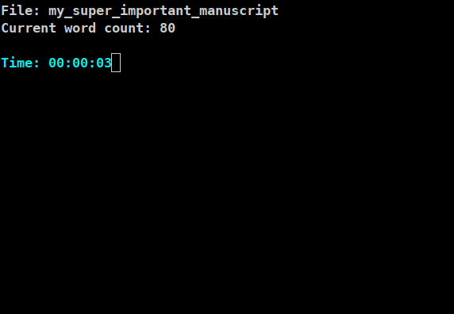
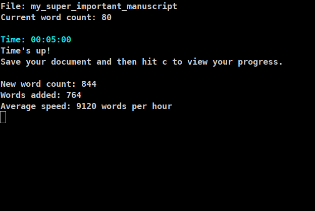

# Wordsmith
Command line utility to aid in writing sprints.

| Sit Down | And Write |
| --- | --- |
|  |  |

## Purpose

This is a simple tool to "benchmark" writing speed over a given time period.
It is targeted at Unix people who get their writing assignments done by 
[sprinting](http://xulonpressblog.com/author-inspirations/writing-prompts-word-sprints/) and
prefer a minimal console program to some big GUI app. In retrospect this might indeed be
a very narrow target audience. 

###### Supported Documents
* Plain Text
* Odt (OpenOffice)
* Docx (Microsoft Word)
* TeX (Experimental, everything between `\begin{document}` and `\end{document}` will be fed through a rudimentary 
regex filter to skip formating commands.)

## Dependencies
* The fancy statistics are implemented via [Ncurses](https://invisible-island.net/ncurses/ncurses.html).
* [Libmagic](https://www.darwinsys.com/file/) for file identification.
* [Libzip](https://libzip.org/) for odt and docx files.

## Installation
[Cmake](https://cmake.org/) is used to build the program. After extracting the sources the build procedure
would look something like this:

```
mkdir build
cd build
cmake ../ -D CMAKE_BUILD_TYPE=Release
make
```

## Usage
All properties of the writing sprint are set on the command line:

`wordsmith -f <path-to-manuscript> -t <sprint-time-in-minutes>`

Don't forget to save your document once the sprint is over! (Also, since the philosophy of sprinting is that
the only valid direction is forward, the script will report a negative value if the word count has been reduced.)

## Limitations
* No GUI (obviously). There might be a Qt version in the future.
* Windows is currently not supported.

## Authors
**Van Ziegelstein** - Creator and Maintainer

## License
This tool is licensed under the [MIT License](LICENSE).
